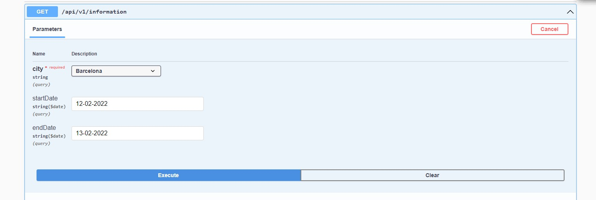
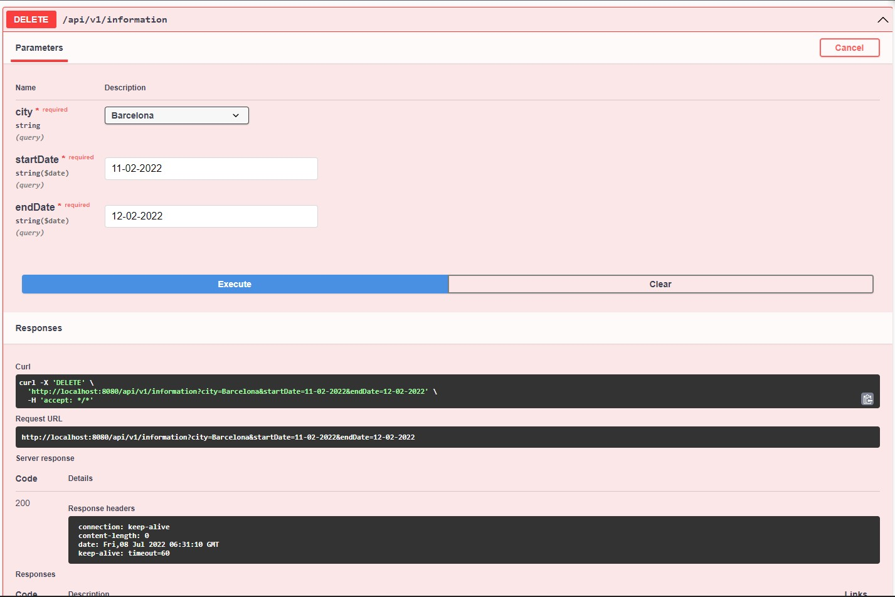

# MobileAction-Final-Project

Muhammet Abdullah Koç

## Note: Because IP's are changing, you need to change IP address of postgres configuration at application.properties before running the application.

Screenshots

## Getting information

## Response

## Delete request

## Logging

